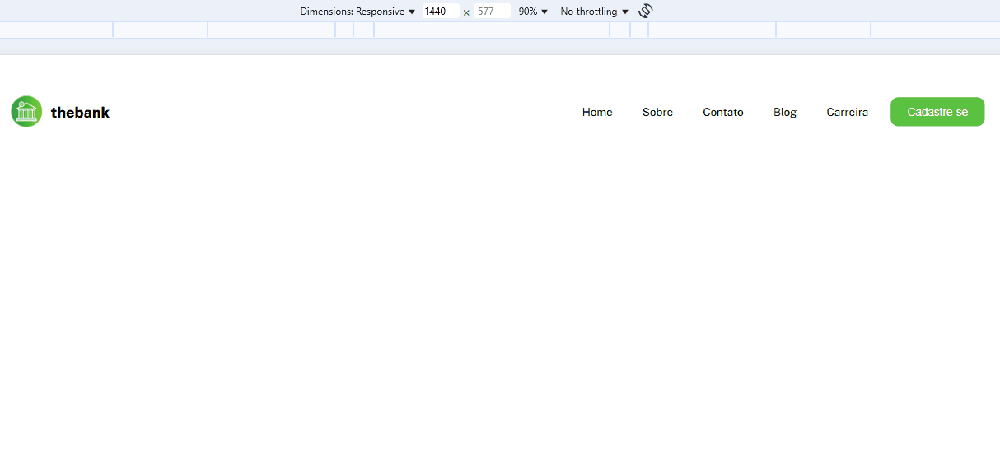

# Exercício DevQuest menu flexbox
Abordando conceito da propriedade flexbox, responsividade e  posicionamento.
## Tecnologias utlizadas
- HTML5
- CSS3
## Objetivos
- Praticar os conteúdos do curso
- Responsividade.
- Alinhamento dos elementos.
## Prévia da aplicação
[]